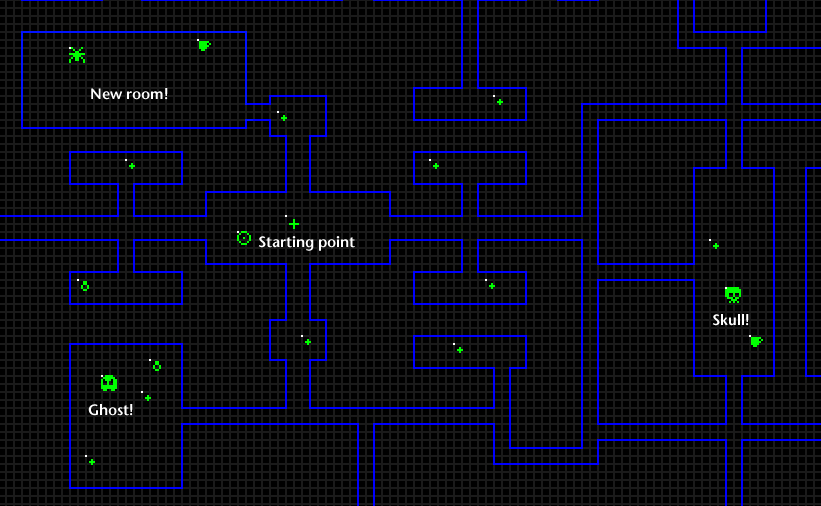

Temple of ROM II
==========

Starting from a disassembly of a Temple of ROM cart by William Astle, I've managed to build the game successfully.
I'm hoping to expand the game by adding new features:

* Expand level -- DONE
* More rooms, monsters and treasures -- DONE
* Different monsters -- DONE
* What else?  Dunno!

I'm hoping to have something available for sale eventually, but the primary goal of this project is to have *fun*!
Please do look over my shoulder as I work on this and feel free to contact me
via the #temple-of-rom-ii channel on [Discord](https://discord.gg/4J5nHXm) .

### Changes

Created project from Temple of ROM disassembly.

Cleaned up direct page.

Split into separate source files.

Deciphered maze, monster, portal and treasure data formats.

Added generation of arbitrary number of portals, monsters, treasures, walls.

Expanded to add more rooms (the maze is 45% larger!), monsters, treasures.

CLEAR, ENTER and SHIFT change video modes.

BREAK quits the game and exits to RSDOS.

Added two more types of monsters:

* Ghosts (slow but invisible till you aggro them)
* Skulls (fast, nasty little buggers)

Added ability to generate level data from a gif image:

* Use PSD file to alter/expand walls, add monsters and treasures.
* Walls have to be vertical/horizontal, on grid lines.
* "Objects" layer shows how to create monsters and treasures.
* White "hot spot" of each object needs to align on the grid as shown.
* "Hot spot" of monsters must have a wall to the left, right, above and below.
* Use optional yellow walls to denote monster aggro area.
* Include all layers.
* Save edited PSD as /map/map.gif, then _make_ to build new version.

Generated levels now will build memory tables sized to the number of monsters/treasures specified.
